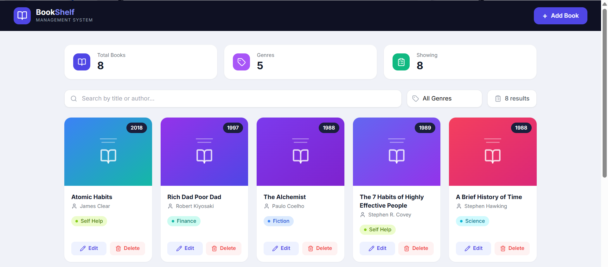
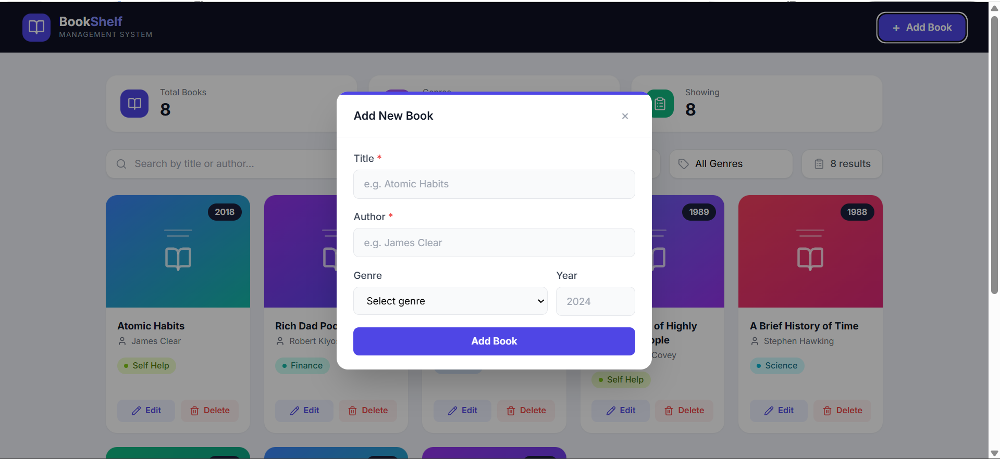

# 📚 BookShelf — Book Management System

A simple and clean Book Management System built with **React.js** and **Tailwind CSS**. Supports full CRUD operations using a MockAPI backend.

---

**Live Demo:** [https://book-management-gules.vercel.app/](https://book-management-gules.vercel.app/)

---

## Screenshots

### Dashboard — Book List View


### Add New Book — Modal Form


---

## 🚀 Features

- 📖 View all books in a responsive card grid
- ➕ Add new books via a modal form
- ✏️ Edit existing books
- 🗑️ Delete books with confirmation
- 🔍 Search books by title or author
- 🏷️ Filter books by genre
- 📊 Stats: Total books, genres count, filtered results
- ⚡ Loading states and error handling with retry
- 🔔 Toast notifications for all actions

---

## 🛠️ Tech Stack

| Tool | Purpose |
|------|---------|
| React 19 | UI framework |
| Vite | Build tool and dev server |
| Tailwind CSS | Styling |
| Lucide React | Icons |
| MockAPI.io | Live REST API backend |

---

## 📁 Project Structure

```
book-management/
├── src/
│   ├── services/
│   │   └── bookApi.js         # API functions (fetch, create, update, delete)
│   ├── components/
│   │   ├── Header.jsx         # Top navbar with Add Book button
│   │   ├── SearchBar.jsx      # Search input + genre filter + results count
│   │   ├── BookList.jsx       # Grid of book cards
│   │   ├── BookCard.jsx       # Individual book card
│   │   ├── BookForm.jsx       # Add / Edit form with validation
│   │   ├── Modal.jsx          # Reusable modal wrapper
│   │   ├── DeleteConfirm.jsx  # Delete confirmation dialog
│   │   ├── Loader.jsx         # Loading spinner
│   │   └── ErrorMessage.jsx   # Error display with retry
│   ├── App.jsx                # Root component — all state & CRUD logic
│   ├── main.jsx               # React entry point
│   └── index.css              # Global styles + Tailwind imports
├── tailwind.config.js
├── postcss.config.js
├── vite.config.js
└── package.json
```

---

## ⚙️ Setup & Installation

### 1. Extract the project

```bash
cd book-management
```

### 2. Install dependencies

```bash
npm install
```

### 3. Start the development server

```bash
npm run dev
```

Open your browser at **http://localhost:5173**

### 4. Build for production

```bash
npm run build
```

---

## 🌐 API

**Base URL:** `https://6a15be1091ff9a63de08b607.mockapi.io/api/v1/books`

| Method | Endpoint | Description |
|---|---|---|
| GET | `/books` | Fetch all books |
| POST | `/books` | Add a new book |
| PUT | `/books/:id` | Update a book |
| DELETE | `/books/:id` | Delete a book |

**Book object shape:**

```json
{
  "id": "1",
  "title": "Atomic Habits",
  "author": "James Clear",
  "genre": "Self Help",
  "year": 2018
}
```

---

## 📝 Available Genres

`Fiction` `Non-Fiction` `Science` `History` `Fantasy` `Biography`
`Mystery` `Romance` `Technology` `Self Help` `Finance` `Business`
`Psychology` `Philosophy`

---

## 🔑 Key Implementation Notes

- **No-ID seed books:** MockAPI seed books return no `id`. The app assigns a `_localId` to each book on load so edit/delete work correctly for all books.
- **Update strategy:** After a PUT request, state is updated locally by merging form data — ensures `genre`, `year` always reflect the latest values regardless of what MockAPI returns.
- **Component-based:** Each UI concern is a separate component. `App.jsx` only handles state and business logic.

---

